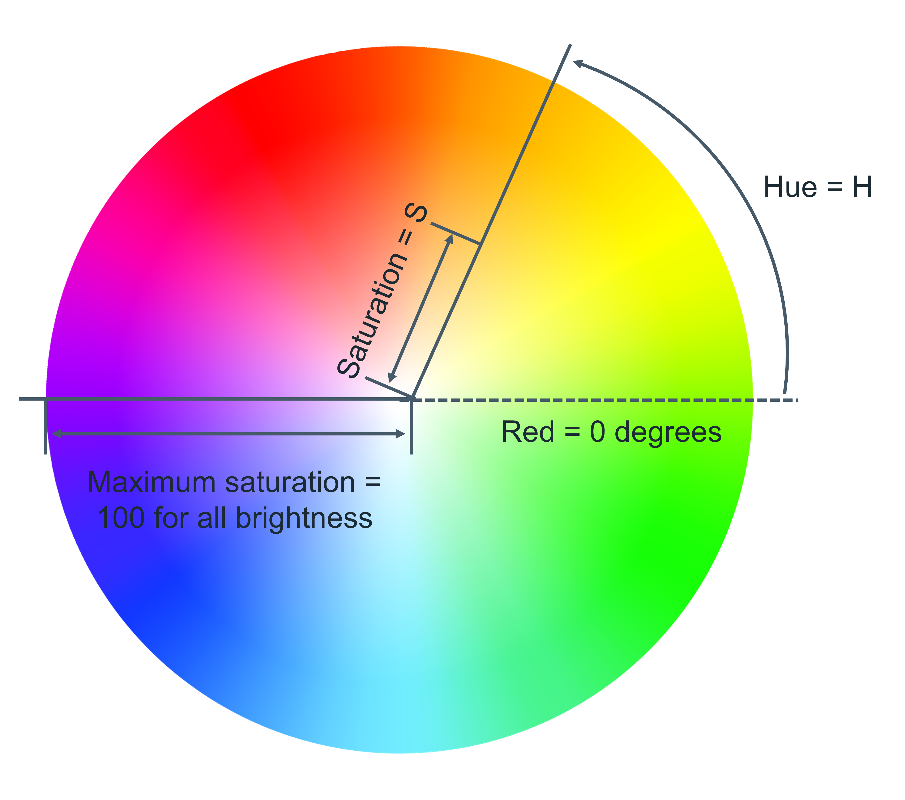
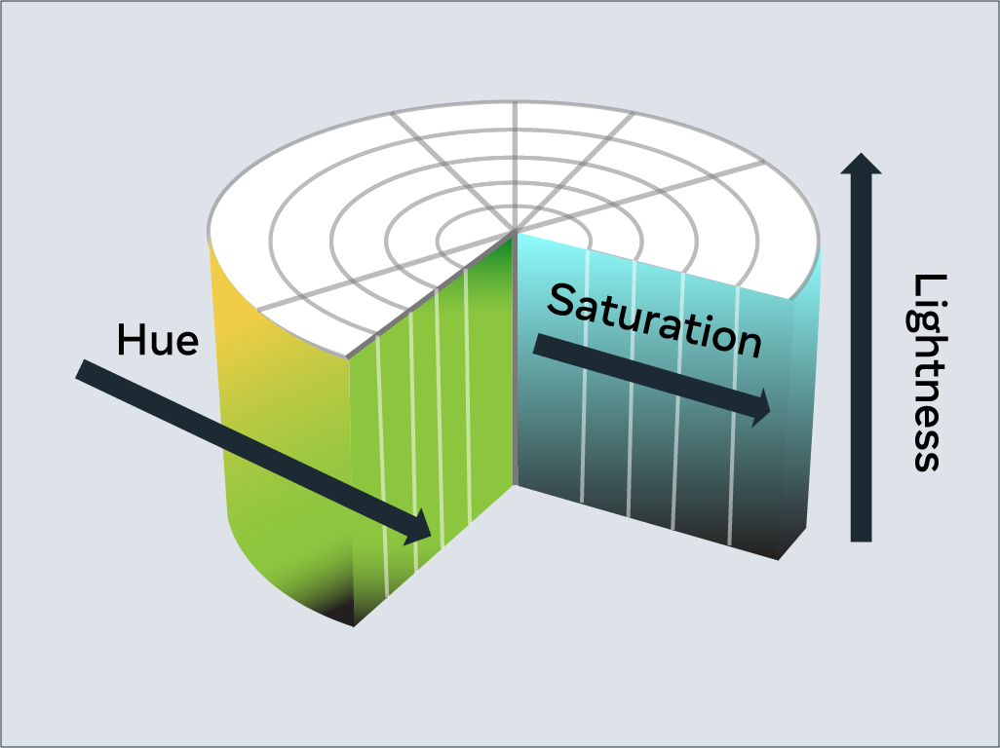

## Text and color in CSS
As you design websites, you'll be working a lot with colors and text. There are many different ways to display text and equally as many ways to define colors.

This reading covers how text and color work in CSS.

## <strong>Color</strong>
Colors are used in many CSS properties, for example:
```
p { 
  color: blue; 
}
```

From CSS Version 3, there are five main ways to reference a color.
<ul>
<li>By RGB value,</li>
<li>By RGBA value,</li>
<li>By HSL value,</li>
<li>By hex value and</li>
<li>By predefined color names.</li>
</ul>

## <strong>RGB value</strong>

RGB is a color model that adds the colors red (R), green (G) and blue (B) together to create colors. This is based on how the human eye sees colors.

Each value is defined as a number between <strong>0</strong> and 255, representing the intensity of that color.

For example, the color red would have the RGB value of <strong>255,0,0</strong> since the intensity of the red color would be 100% while blue and green would be 0%.

The color black then would be 0,0,0 and the color white <strong>255,255,255</strong>.

When using RGB values in CSS, they can be defined using the <strong>rgb</strong> keyword:
```
p { 
  color: rgb(255, 0, 0); 
}
```

## <strong>RGBA value</strong>

RGBA is an extension of RGB that add an alpha (A) channel. The alpha channel represents the opacity, or transparency, of the color.

Similar to RGB, this is specified in CSS using the rgba keyword:
```
p { 
  color: rgba(255, 0, 0, 128); 
}
```

## <strong>HSL value</strong>

HSL is a newer color model defined as Hue (H), Saturation (S) and Lightness (L). The aim of the model is to simplify mental visualization of the color that the value represents.

Think of a rainbow that has been turned into a full circle. This represents the Hue. The Hue value is the degree value on this circle, from 0 degrees to 360 degrees. 0 is red, 120 is green and 240 is blue.



Color gradient palette displaying Hue and Saturation
Saturation is the distance from the center of the circle to its edge. The saturation value is represented by a percentage from 0% to 100% where 0% is the center of the circle and 100% is its edge. For example, 0% will mean that the color is more grey and 100% represents the full color.

Lightness is the third element of this color model. Think of it as turning the circle into a 3D cylinder where the bottom of the cylinder is more black and toward the top is more white. Therefore, lightness is the distance from the bottom of the cylinder to the top. Again, lightness is represented by a percentage from 0% to 100% where 0% is the bottom of the cylinder and 100% is its top. In other words, 0% will mean that the color is more black and 100% is white.



In CSS, you use the hsl keyword to define a color with HSL.
```
p { 
  color: hsl(0, 100%, 50%);
}
```

## <strong>Hex value</strong>

Colors can be specified using a hexadecimal value. If you're unfamiliar with hexadecimal, think of it as a different number set.

Decimal is what you use every day. Digits range from <strong>0 to 9</strong> before tens and hundreds are used.

Hexadecimal is similar, except it has 16 digits. This is counted as <strong> 0, 1, 2, 3, 4, 5, 6, 7, 8, 9, A, B, C, D, E, F </strong>.

In fact, you can convert between decimal and hexadecimal. Decimal 10 is equal to hexadecimal <b>A</b>. Hexadecimal <b> F</b> is equal to decimal 15.

Hexadecimal can also go to tens and hundreds. For example, decimal 16 is equal to hexadecimal 10, with 10 being the next number after F.

It can be a little confusing at first but don't worry, there are plenty of converters available if you get stuck.

Colors specified using hexadecimal are prefixed with a # symbol followed by the RGB value in hexadecimal format.

For example, the color red which is RGB 255,0,0 would be written as hexadecimal #FF0000.

Again don't worry if you get stuck, there are plenty of converters available for this too!

## <strong>Predefined color names</strong>

Modern web browsers support 140 predefined color names. These color names are for convenience purposes and can be mapped to equivalent hex/RGB/HSL values.

Some common color names available are listed below.
```
black
silver
gray
white
maroon
red
purple
fuchsia
green
lime
```

## <strong>Text</strong>
With CSS there are many ways to change how text is displayed. In this section, you'll learn the most common text manipulation CSS properties.

## <strong>Text Color</strong>

The color property sets the color of text. The following CSS sets the text color for all paragraph elements to red.
```
p { 
  color: red;
}
```

## <strong>Text Font and Size</strong>

There are many different fonts to display text on your computer. In simple terms, a font is a collection of text characters written in a specific style and size.

If you've used a word processor before, you're probably familiar with the fonts Times New Roman and Calibri.

To set the font used by text in CSS you use the font-family property.
```
p { 
  font-family: "Courier New", monospace;
}
```

Since computers vary in what fonts they have installed, it is recommended to include several fonts when using the <b>font-family</b> property. These are specified in a fallback order, meaning that if the first font is not available, it will check for the second font. If the second font is not available, then it will check for the third font and so on. If none of the fonts are available, it will use the browser's default font.

To set the size of the font, the <b>font-size</b> property is used.
```
p { 
  font-family: "Courier New", monospace;
  font-size: 12px;
}
```

## <strong>Text Transformation</strong>

Text transformation is useful if you want to ensure the correct capitalization of the text content. In the example below, the CSS rule will change all text in paragraph elements to uppercase using the text-transform property:
```
p { 
  text-transform: uppercase;
}
```

The most commonly used values for the `text-transform` property are: `uppercase,  lowercase,  capitalize  `and `none`. The default value used is none, which means the text displays as it was written in the HTML document.
## <strong></strong>
## <strong>Text Decoration</strong>

The `text-decoration` property is useful to apply additional decoration to text such as underlining and line-through (strikethrough).
```
p { 
  text-decoration: underline;
}
```

It is possible to set the color, thickness and styling of the decoration too. In the example below, the underline will be a solid red line that is 5 pixels thick.
```
p { 
  text-decoration: underline red solid 5px;
}
```

If this is confusing, don't worry. These properties can be individually set using the `text-decoration-line, text-decoration-color, text-decoration-style` and `text-decoration-thickness` properties. Let's use the same example again and define it using the individual properties:
```
p { 
  text-decoration-line: underline;
  text-decoration-color: red;
  text-decoration-style: solid;
  text-decoration-thickness: 5px;
}
```

The most common `text-decoration-line` values used are: `underline, overline, line-through` and `none`. None is the default value to use no text decoration.

There are many styles available for the `text-decoration-style`  property;  `solid,  double,  dotted,  dashed  and  wavy`. The text-decoration-style property requires the decoration line to be defined. If the decoration style is not specified, solid will be used.