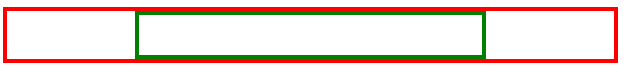

# Alignment basics
Let's explore how to align text and HTML elements using CSS.

Let's first focus on horizontal alignment. Vertical alignment is more difficult so you'll explore that later on.

## <strong>Text Alignment</strong>

Aligning text within an HTML element is very simple. To do this, you use the text-align CSS property. In the following example, the CSS rule is setting the text of all paragraph elements to be center aligned.

```
p {
    text-align: center;
}
```

Text alignment can be set to `left, right, center and justify`.

The `justify` alignment spreads the text out so that every line of the text has the same width.

The default alignment is `left` for languages that are left-to-right such as English. For right-to-left languages such as Arabic, the default alignment is `right`.

## <strong>HTML Element Alignment</strong>
HTML element alignment is more complicated than text alignment. To align HTML elements, you must consider the box model and document flow from previous lessons. Aligning an HTML element is done by changing the properties of its box model and how it impacts the document flow.

## <strong>HTML Element Center Alignment</strong>
To center align an element, you set a width on the element and push its margins out to fill the remaining available space of the parent element as in the following HTML structure:

```
<div class="parent">
  <div class="child">
  </div>
</div>
```
In your CSS, you'll set the `parent` element to have a red border to visualize the space it occupies:
```
.parent {
  border: 4px solid red;
}
```
The `child` element will have a width equal to 50% of the `parent` element with a padding of 20 pixels. Note that `padding: 20px` is shorthand for setting the padding top, bottom, left and right to `20px`. To visualize the space it occupies, set the border to green:

```
.child {
  width: 50%;
  padding: 20px;
  border: 4px solid green;
}
```

To align the element to the center, set its `margin` property to `auto`. The `auto` will tell the browser to calculate the margin automatically based on the space available.

```
.child {
  width: 50%;
  padding: 20px;
  border: 4px solid green;
  margin: auto;
}
```

The result is the `child` element is centered within the `parent` element:



It is important to note that this works because the `div` element is a block-level element.  

If you want to align an inline element like `img`, you will need to change it to a block-level element. Similar to the `div` example, you add the `img` to a parent element:

```
<div class="parent">
  
</div>
```

The CSS rule then changes the `img` element to a block-level element and sets its margin to `auto`:

```
.child {
  display: block;
  width: 50%;
  margin: auto;
}
```

To be more precise, in CSS you can set only the left and right margins to auto. This allows you to set the top and bottom margins to specific values if needed.

```
.child {
  display: block;
  width: 50%;
  margin-left: auto;
  margin-right: auto;
}
```
## <strong></strong>
## <strong>HTML Element Left / Right Alignment</strong>

The two most common ways to left and right align elements are to use the `float` property and the `position` property.

The `position` property has several value options that impact how the element displays in the document flow. You'll explore how to use the `position` property later on. For now, let's focus on the `float` property.

The `float` property sets an element's position relative to the text content within a parent element. Text will wrap around the element.

In the following example, the image will be aligned to the right of the `div` element. The text content will wrap around the image:

_HTML_

```
<div class="parent">
   Lorem ipsum dolor sit amet, consectetur adipiscing elit. Curabitur eu odio eget leo auctor porta sit amet sit amet justo. Donec fermentum quam in diam volutpat, at lacinia diam placerat. Aenean quis feugiat sem. Suspendisse a dui massa. Phasellus scelerisque, mi vestibulum iaculis tristique, orci tellus gravida nisi, in pellentesque elit massa ut lorem. Sed elementum ornare nunc vel cursus. Duis sed enim in nulla efficitur convallis sed 
```

_CSS_

```
.child {
  float: right;
}
```

The following displays in the web browser:  

